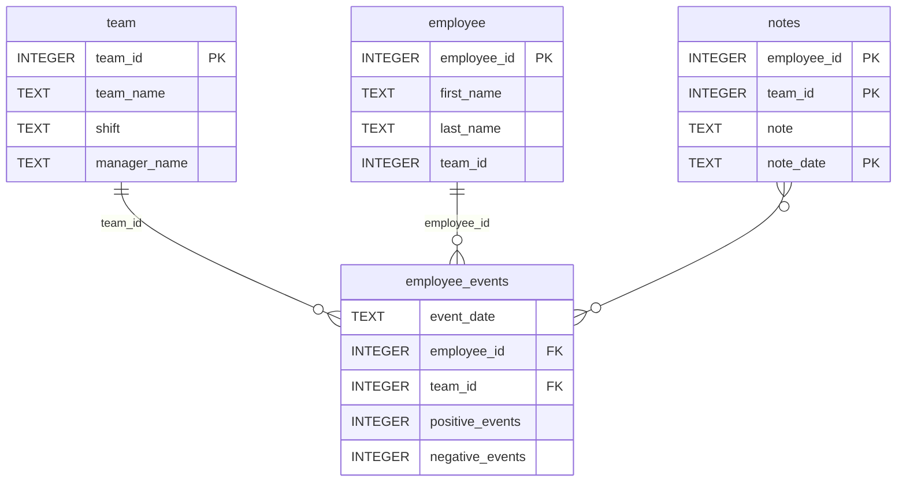

# Software Engineering for Data Scientists 

This repository contains starter code for the **Software Engineering for Data Scientists** final project. Please reference your course materials for documentation on this repository's structure and important files. Happy coding!

## Getting Started

Below are the step-by-step instructions to set up the environment and run the application.

### 1. Prerequisites
Ensure you have the following installed:
* Python 3.8 or higher (Python 3.11 recommended)
* pip
* git

### 2. Installation
Follow these steps to set up the project locally:

**Clone the repository:**
```bash
git clone https://github.com/BeatrizBarriosPerez/dsnd-dashboard-project
```

**Create and activate a virtual environment:**
```bash
python3 -m venv env
source env/bin/activate
```

**Install dependencies:**
```bash
pip install -r requirements.txt
```

### 3. Running the Dashboard
To deploy the dashboard locally, navigate to the project root and run:
```bash
python report/dashboard.py
```

Once the server is running, open your web browser and navigate to the local URL provided in the terminal

### 4. Code Quality & Testing
This project adheres to PEP8 styling.
Testing: Run the test suite using pytest:
```bash
pytest tests/
```

### Repository Structure
```
├── README.md
├── assets
│   ├── model.pkl
│   └── report.css
├── env
├── python-package
│   ├── employee_events
│   │   ├── __init__.py
│   │   ├── employee.py
│   │   ├── employee_events.db
│   │   ├── query_base.py
│   │   ├── sql_execution.py
│   │   └── team.py
│   ├── requirements.txt
│   ├── setup.py
├── report
│   ├── base_components
│   │   ├── __init__.py
│   │   ├── base_component.py
│   │   ├── data_table.py
│   │   ├── dropdown.py
│   │   ├── matplotlib_viz.py
│   │   └── radio.py
│   ├── combined_components
│   │   ├── __init__.py
│   │   ├── combined_component.py
│   │   └── form_group.py
│   ├── dashboard.py
│   └── utils.py
├── requirements.txt
├── start
├── tests
    └── test_employee_events.py
```

### employee_events.db


